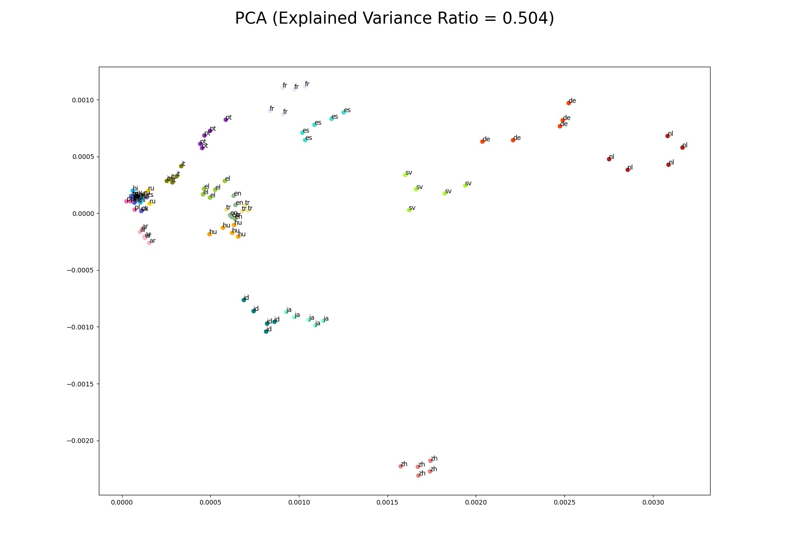
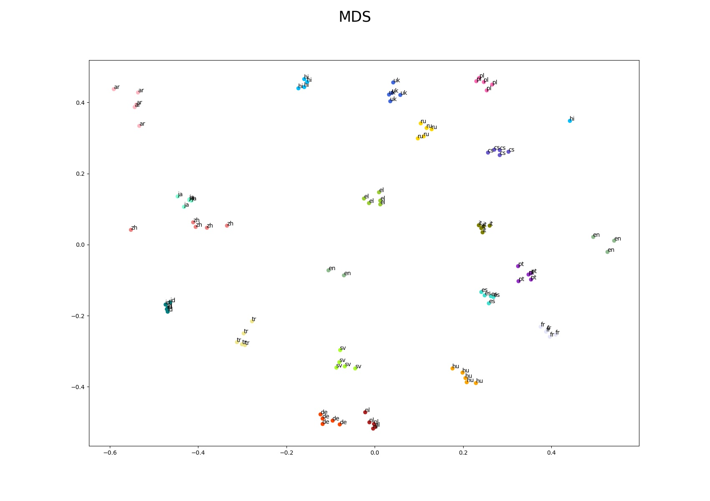
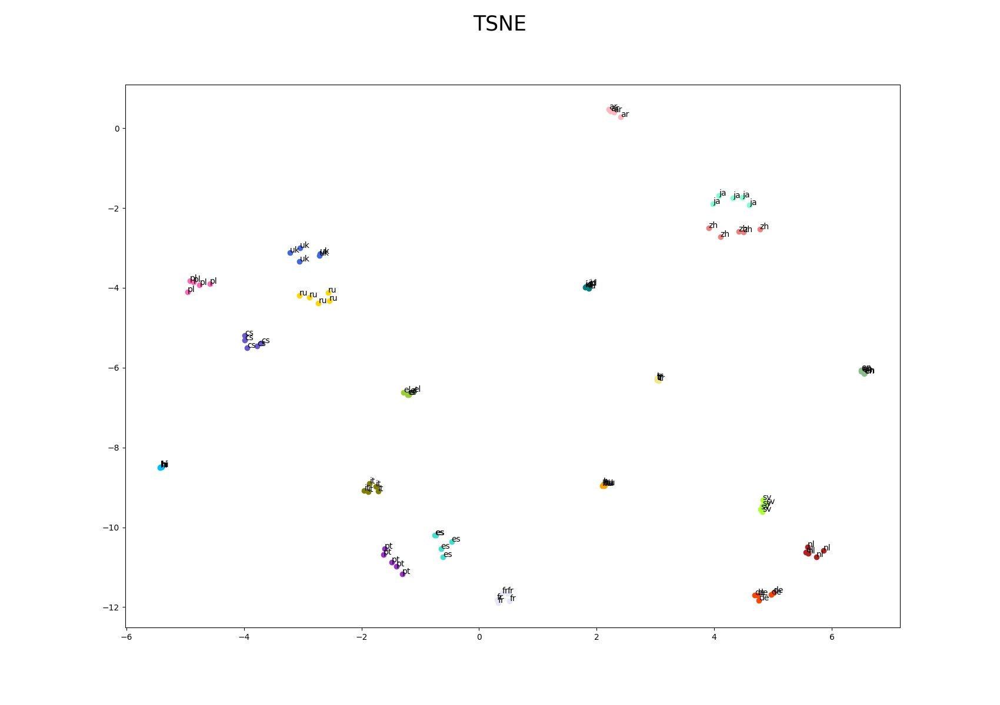

# Projections into lower dimensional spaces

Feature projection (also called feature extraction) transforms the data from the 
high-dimensional space to a space of fewer dimensions. The data transformation 
may be linear, as in principal component analysis (PCA), but many nonlinear 
dimensionality reduction techniques also exist, for example multidimensional 
scaling (MDS), t-distributed stochastic neighbor embedding (t-SNE), etc.

## Results of projection in multidimensional space

